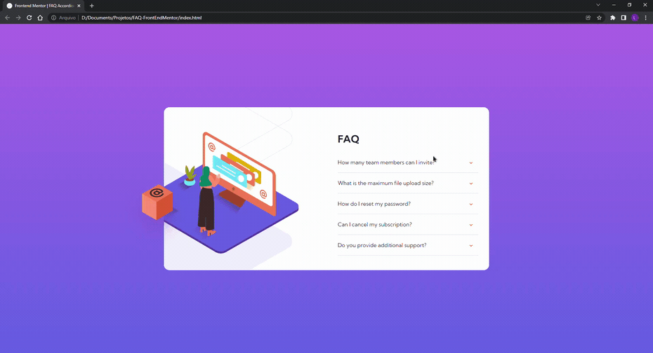

# Frontend Mentor | FAQ Accordion Card 
<p align="center">
  <a href="#o-projeto">Projeto</a>&nbsp;&nbsp;&nbsp;|&nbsp;&nbsp;&nbsp;
  <a href="#tecnologias">Tecnologias</a>&nbsp;&nbsp;&nbsp;|&nbsp;&nbsp;&nbsp;
  <a href="#Behavior">Behavior</a>&nbsp;&nbsp;&nbsp;|&nbsp;&nbsp;&nbsp;
  <a href="#executando-o-projeto">Executar</a>
</p>

## O Projeto
Este projeto é uma solução para o desafio [FAQ accordion card challenge on Frontend Mentor](https://www.frontendmentor.io/challenges/faq-accordion-card-XlyjD0Oam).

## Tecnologias

Esse projeto foi desenvolvido com as seguintes tecnologias:

- HTML
- CSS (com pré-processador SCSS)
- JavaScript

## Behavior




## Executando o projeto

```bash
# Clone este repositório
$ git clone https://github.com/LeandroFilie/FAQ-FrontEndMentor.git

# Acesse a pasta do projeto no seu terminal/cmd
$ cd FAQ-FrontEndMentor
```
Para acesso de forma online, [clique aqui](https://faq-front-end-mentor-leandrofilie.vercel.app/)

---

Feito com :heart: by [Leandro Filié](https://github.com/LeandroFilie)
